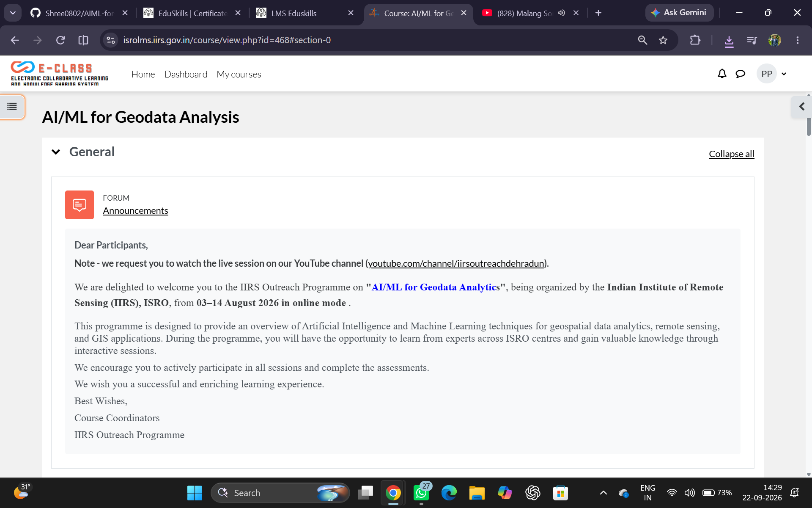
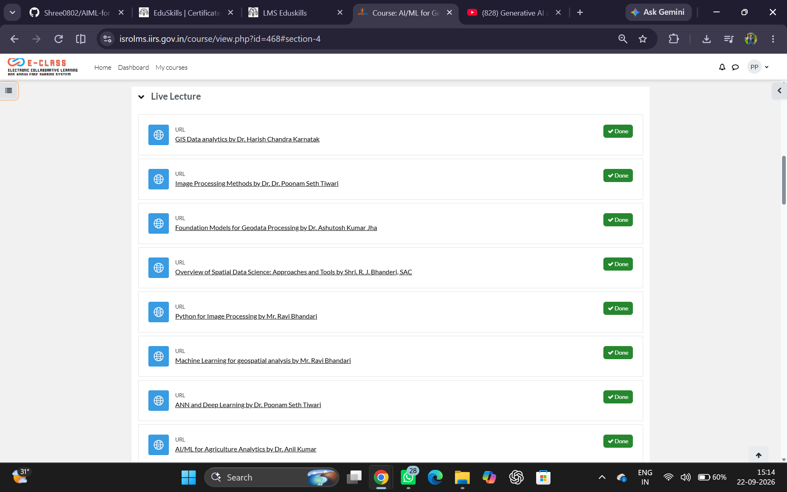
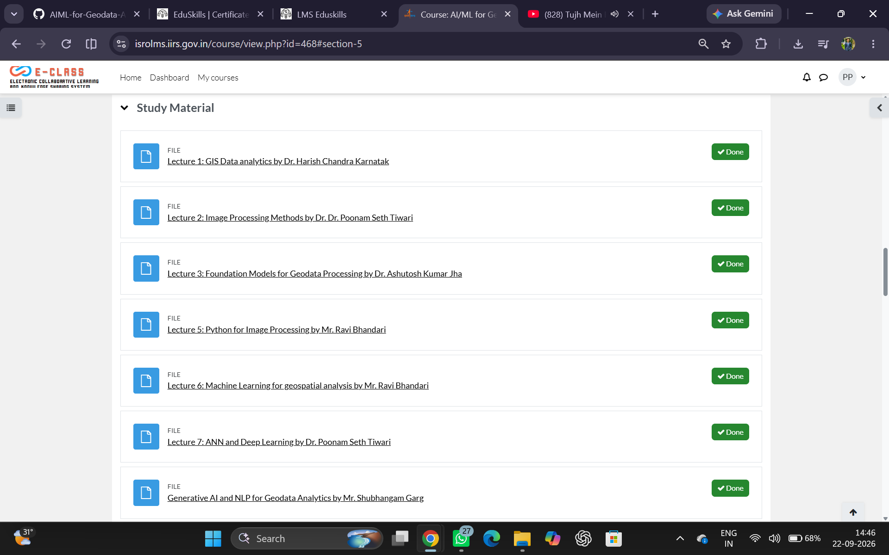
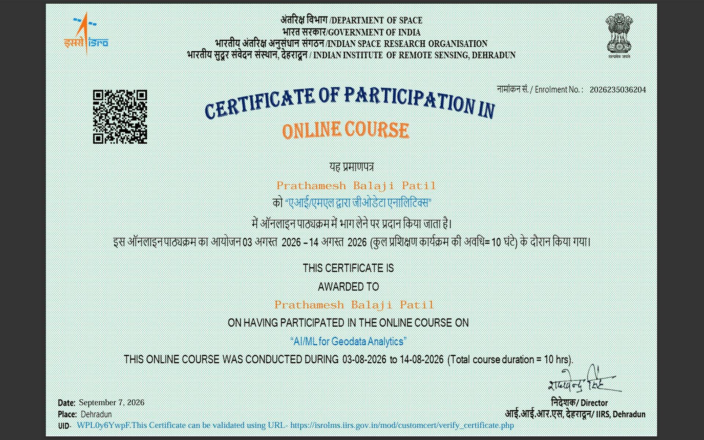

# 🚀 AI/ML for Geodata Analytics | ISRO

A structured repository documenting my learning journey through the **AI/ML for Geodata Analytics** online outreach programme conducted by the **Indian Institute of Remote Sensing (IIRS), ISRO**.

This repository contains the course lectures, study materials, and completion certificate collected during the programme.

---


## 📌 About the Course

**AI/ML for Geodata Analytics** is an IIRS Outreach Programme organized by the **Indian Institute of Remote Sensing (IIRS), ISRO**.

The programme focuses on the application of **Artificial Intelligence and Machine Learning** techniques to:

- Geospatial Data Analytics
- Remote Sensing
- GIS Applications
- Image Processing
- Machine Learning
- Deep Learning
- Foundation Models
- Generative AI
- Natural Language Processing
- Agriculture Analytics
- Spatial Data Science
- GeoAI and Smart Governance

📅 **Programme:** 03–14 August 2026  
🏛️ **Organized by:** Indian Institute of Remote Sensing (IIRS), ISRO  
💻 **Mode:** Online

---

## 🎯 Learning Objectives

Through this programme, I explored how AI/ML techniques can be applied to geospatial and remote sensing data.

Key learning areas include:

- Understanding geospatial data and GIS analytics
- Image processing and image analysis
- Machine Learning for geospatial applications
- Artificial Neural Networks and Deep Learning
- Foundation Models for geodata processing
- Generative AI, LLMs and NLP
- Python for image processing
- AI/ML applications in agriculture
- GeoAI for governance and decision-making
- Spatial Data Science and its tools

---

## 📚 Course Lectures

The repository includes the lectures covered during the programme.

| # | Topic | Instructor |
|---|---|---|
| 01 | GIS Data Analytics | Dr. Harish Chandra Karnatak |
| 02 | Image Processing Methods | Dr. Poonam Seth Tiwari |
| 03 | Foundation Models for Geodata Processing | Dr. Ashutosh Kumar Jha |
| 04 | Overview of Spatial Data Science: Approaches and Tools | Shri R. J. Bhanderi, SAC |
| 05 | Python for Image Processing | Mr. Ravi Bhandari |
| 06 | Machine Learning for Geospatial Analysis | Mr. Ravi Bhandari |
| 07 | ANN and Deep Learning | Dr. Poonam Seth Tiwari |
| 08 | AI/ML for Agriculture Analytics | Dr. Anil Kumar |
| 09 | GeoAI for Smarter Governance | Shri. Nilay Nishant, NESAC |
| 10 | Generative AI and NLP for Geodata Analytics | Mr. Shubhangam Garg |

👉 Complete lecture links are available in the [`Lectures`](./Lectures) folder.



---

## 📖 Study Materials

The `Study_Material` folder contains the learning resources and lecture materials associated with the programme.

### Topics Covered

- **GIS Data Analytics**
- **Machine Learning**
- **Digital Classification, Image Analysis and Processing**
- **Foundation Models**
- **ANN and Deep Learning**
- **Generative AI, LLM & NLP for Geodata**
- **Image Processing**
- **Geospatial Analytics**

📂 [View Study Materials](./Study_Material)



---

## 🏆 Achievement

I successfully completed the **AI/ML for Geodata Analytics** programme conducted by the **Indian Institute of Remote Sensing (IIRS), ISRO**.

The completion certificate is available in:

📂 [`Achievements/`](./Achievements)

📜 [View Completion Certificate](./Achievements/Completion_Certificate.pdf)



---

## 🗂️ Repository Structure

```text
AI-ML-for-Geodata-Analysis-ISRO/
│
├── 📁 Achievements/
│   ├── 📜 Completion_Certificate.pdf
│   └── README.md
│
├── 📁 Lectures/
│   └── README.md
│
├── 📁 Study_Material/
│   ├── 📄 ANN and Deep Learning.pdf
│   ├── 📄 Concepts of Digital Classification,
│   │      Image Analysis and Processing.pdf
│   ├── 📄 Foundational Model.pdf
│   ├── 📄 GIS_data_analytics_REVISED.pdf
│   ├── 📄 GenerativeAI_LLM_NLP_Geodata.pdf
│   └── 📄 Intro_machine_learning.pdf
│
└── 📄 README.md
